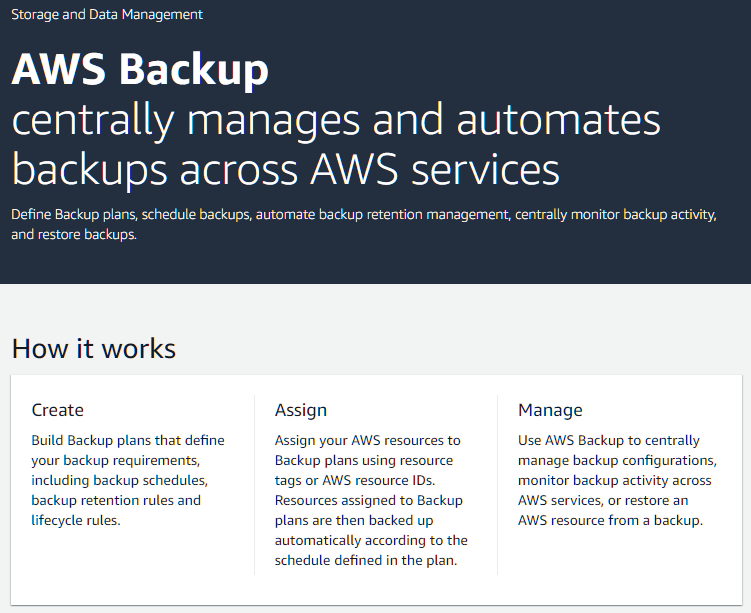
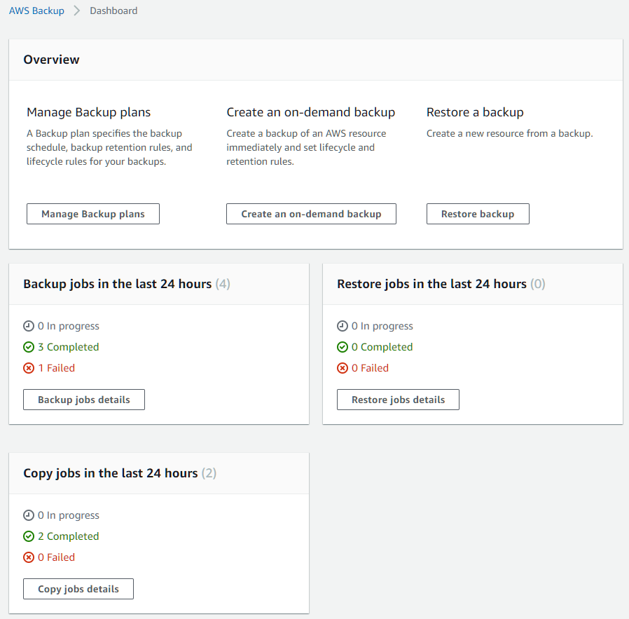
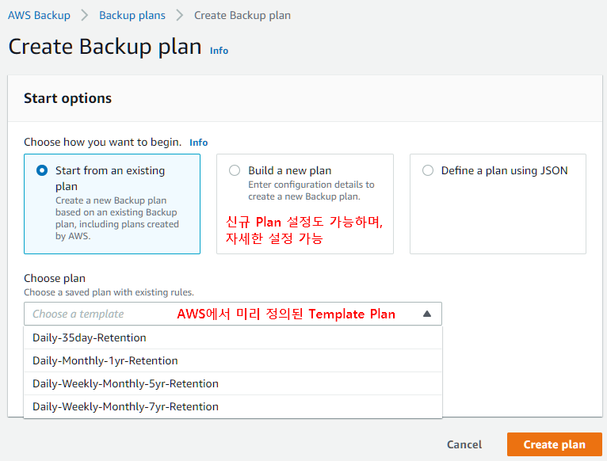
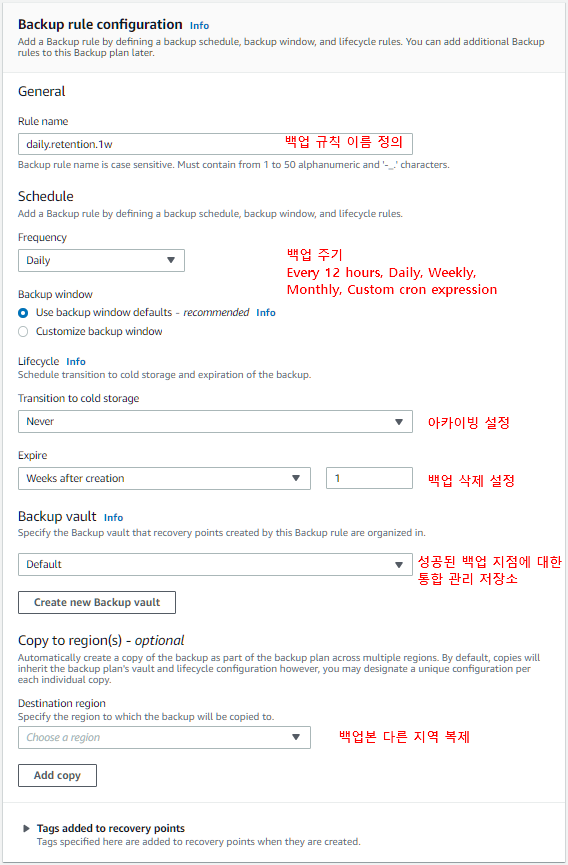
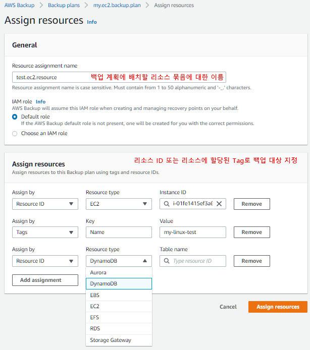

# Backup
클라우드 및 온프레미스에서 AWS 서비스 전반에 걸친 데이터 백업을 쉽게 중앙 집중화하고 자동화할 수 있는 종합 관리형 백업 서비스.
AWS Backup을 사용하면 AWS 리소스에 대한 백업 정책 구성 및 백업 활동 모니터링을 한 곳에서 수행이 가능.

> 2019.1 첫 공식 발표  
https://aws.amazon.com/blogs/aws/aws-backup-automate-and-centrally-manage-your-backups/  
>
> 2020.1 EC2, EFS 백업, 리전복제 지원 발표  
https://aws.amazon.com/blogs/aws/aws-backup-ec2-instances-efs-single-file-restore-and-cross-region-backup/

# 지원되는 리소스
서비스|리소스
-|-
Amazon Elastic File System(Amazon EFS)| Amazon EFS 파일 시스템
Amazon DynamoDB|DynamoDB 테이블
Amazon Elastic Compute Cloud(Amazon EC2)| Amazon EC2 인스턴스
Amazon Elastic Block Store(Amazon EBS)|Amazon EBS 볼륨
Amazon Relational Database Service(Amazon RDS)|Amazon RDS 데이터베이스
Amazon Aurora| Aurora 클러스터
AWS Storage Gateway| AWS Storage Gateway 볼륨

# 기능
- 중앙 집중식 백업 관리  
백업 콘솔, 백업 API, AWS CLI를 제공.  
백업 정책을 중앙 집중식으로 관리할 수 있고, 백업 활동 로그에 대한 통합 보기를 제공.  

- 교차 리전 백업  
백업을 여러 다른 AWS 리전으로 복사할 수 있다.  
교차 리전 백업은 비즈니스 연속성 또는 규정 준수 요구 사항이 있는 경우 특히 유용.

- 정책 기반 백업 솔루션  
백업 계획이라고 하는 백업 정책을 생성할 수 있다. 이를 사용하여 백업 요구 사항을 정의하고 AWS 리소스에 적용.  

- 태그 기반 백업 정책  
태그를 지정하여 백업 계획을 적용할 수 있다. 태그를 지정하면 모든 애플리케이션에 걸쳐 백업 전략을 구현할 수 있다.  

- 백업 활동 모니터링  
대시보드를 제공하므로, 백업 및 복원 활동을 감사할 수 있다.  
CloudTrail은 백업 활동 로그의 통합 보기를 제공하므로 리소스가 백업되는 방식을 빠르고 쉽게 감사할 수 있다.  
또한 AWS Backup은 Amazon Simple Notification Service(Amazon SNS)와 통합되어 백업이 성공하거나 복원이 시작될 때 등 백업 활동 알림을 제공함.

- 수명 주기 관리 정책  
백업을 저렴한 콜드 스토리지 티어에 저장하여 백업 스토리지 비용을 최소화하는 동시에 규정 준수 요건을 충족할 수 있다.  
정의한 일정에 따라 백업을 웜 스토리지에서 콜드 스토리지로 자동 전환하도록 수명 주기 정책을 구성할 수도 있다.

- 백업 액세스 정책  
백업에 대한 액세스 권한이 있는 사용자를 정의할 수 있도록 백업 볼트에 대한 리소스 기반 액세스 정책을 제공.  

# 구성
## Backup

## Backup Dashboard

## Backup plans

### Backup rules

### Resource assignments

# 별첨
## AWS Backup과 EBS Lifecycle Manager 차이

> 2018.7 공개  
https://aws.amazon.com/blogs/aws/new-lifecycle-management-for-amazon-ebs-snapshots/

AWS Backup과 Lifecycle Manager는 서로 독립적으로 작동되며, 두 방법 모두 EBS 스냅샷을 관리가능  
그러나 Backup의 경우 cold transition이 지원되고, Lifecycle Manager에서는 빠른 스냅샷 복원이 지원됨. 