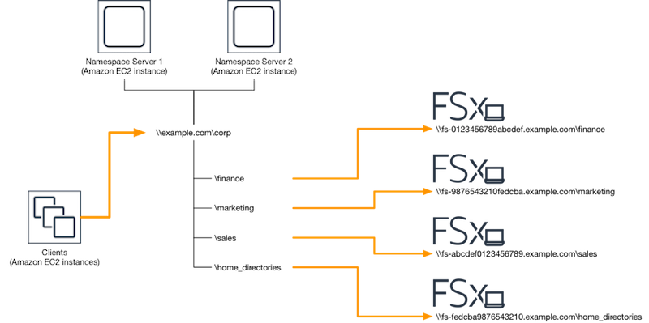
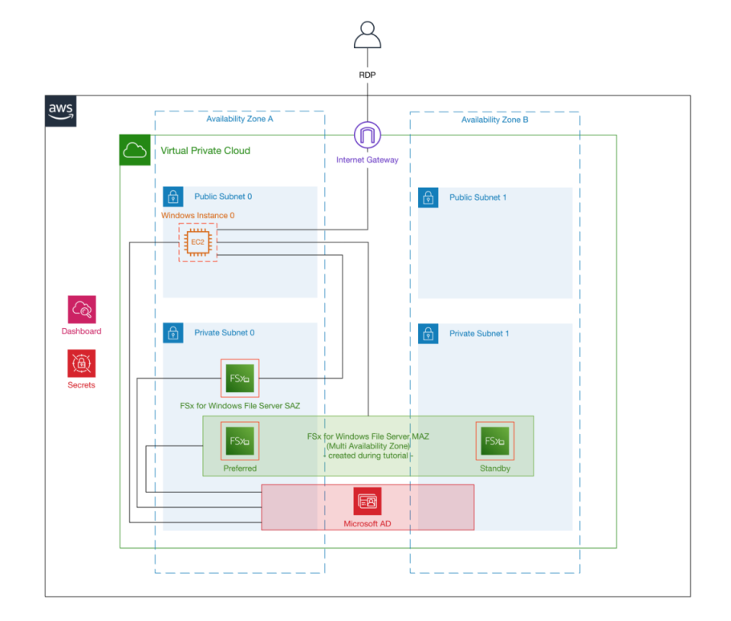
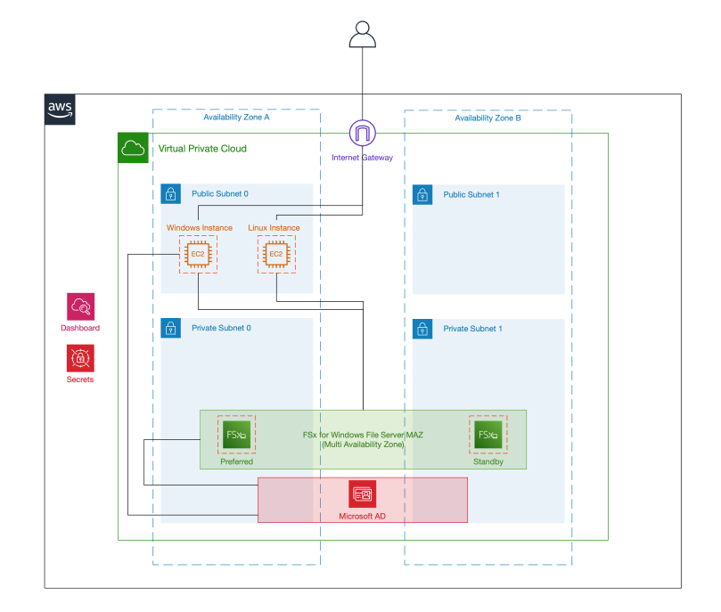

# Amazon FSx
## Amazon FSx for Windows File Server
업게 표준 SMB(Service Message Block) 프로토콜을 통해 액세스 할 수 있는 완전 관리되고 안정적인 파일 스토리지 제공  

URL : https://aws.amazon.com/ko/blogs/korea/new-amazon-fsx-for-windows-file-server-fast-fully-managed-and-secure/
## ~~Amazon FSx for Lustre~~
~~기계학습, 고성능 컴퓨팅(HPC), 비디오 처리, 재무 모델링 및 EDA(Electronic Design Automation)와 같은 워크로드의 빠른 처리에 최적화 된 고성능 파일 시스템 제공~~

~~URL : https://aws.amazon.com/ko/blogs/korea/new-amazon-fsx-for-lustre/~~

## 특징
- 접근성 및 프로토콜 지원  
Amazon EC2 인스턴스(Windows), Amazon WorkSpaces 등에서 사용됨.  
SMB 2.0~3.1.1까지 지원
- 성능 밑 튜닝 기능  
FSx for Windows File Server는 일관된 밀리초 미만의 지연 시간을 제공.  
파일 시스템 크기와 처리량(MB/s)을 각각 자유롭게 독립적으로 설정 가능.  
크기 : 32GB~64TB, 초당처리량 : 8MB/s~2GB/s
- 관리  
AWS 가용 역역 내에서 이중화되어 저장
매일 자동으로 증분 백업이 수행되며, 추가 백업을 생성할수도 있음
- 보안  
여러 레벨의 액세스 제어 및 데이터 보호가 적용  
엔드포인트, 보안 그룹, Windows ACL, IAM 등을 통해서 제어 가능  
데이터 전송 될때와 저장될 떄 암호화
- 다중 AZ 배포  
파일 시스템은 개별 AWS 가용 영역에 생성되며, Microsoft DFS(Distributed File System)를 사용하여 영역간 자동 복제 및 장애 조치  
Microsoft DFS 네임스페이스를 사용해 여러 파일 시스템에서 공유되는 공통의 네임스페이스를 생성 가능

## 사전 조건
    VPC-Subnet내 Active Directory(AWS service: Directory Service) 필요

## 지원 환경
### 클라이언트
- AWS 인스턴스 : EC2, WorkSpaces, AppStream 2.0  
- OS : Windows Server 2008, 2008 R2, 2012, 2012 R2, 2016, 2019  
Vista, 7, 8, 8.1, 10  
cifs-utils도구를 사용하는 Linux

### 액세스 방법
모든 파일 시스템에 대한 DNS(Domain Name System) 이름을 제공함.  
이 DNS 이름을 사용하여 컴퓨팅 인스턴스의 드라이브 문자를 FSx 파일 공유에 매핑하여 사용하게 됨.  
예) fs-0123456789abcdef0.<span style="color:orange">ad-domain</span>.com

### 네트워크
기본은 파일 시스템과 동일한 VPC내 리소스에서만 액세스가 가능하다.
그러나 다른 서비스와 연계시 다른 VPC, AWS 계정, 온프레미스에서도 액세스가 가능하다.
- On-premises <-> FSx : AWS Direct Connect or AWS VPN
- 다른 VPC or 계정 <-> FSx : VPC peering or Trasit Gateway

## 가용성
배포 타입 특징
Type|SSD|HDD|DFS namespaces|DFS replication|Custom DNS name|CA shares
:-:|:-:|:-:|:-:|:-:|:-:|:-:
Single-AZ1|√||√|√|√||
Single-AZ2|√|√|√||Coming soon|√*
Multi-AZ|√|√|√||Coming soon|√*

Multi-AZ에서는 다음과 같은 상황에 자동 Failover가 지원된다.
- 가용영역 중단
- 사용불가능 하거나 유지보수 중인 경우

Failover시 활동상태를 감지하고 전환되는데 30초 이내가 소비된다.  
※ DNS기반의 failover 방식은 리눅스에서는 자동으로 동작하진 않는다.

Multi-AZ는 서브넷 두개 선택, Single-AZ는 하나의 서브넷만 선택

## 비용 최적화 
- 워크로드 요구 사항에 따른 SSD/HDD 선택
- 데이트 중복 제거 활성화 가능 (powershell 통해서 설정)

## Active Directory
Amazon FSx를 사용하여 파일 시스템을 생성하면 해당 파일 시스템을 Active Directory 도메인에 가입시켜 사용자 인증 및 파일 및 폴더 수준 액세스 제어 가능.
- AWS 관리형 Microsoft AD
- 자체 관리 AD

## DFS 네임스페이스
다른 서버에 있는 공융 폴더를 하나 이상의 논리적으로 구성된 네임스페이스로 그룹화할 수 있도록 하는 Windows Server의 역할 서비스.  
DFS 네임스페이스당 50,000이상의 공유 개수와 3EiB사이즈 가능 



필요조건 : DFS 네임스페이스 서버 쌍

Windows 파일 서버용 Amazon FSx는 Microsoft의 DFS (Distributed File System) 네임 스페이스 사용을 지원.  

DFS 네임서버 구성 CloudFormation Template [URL link](https://solution-references.s3.amazonaws.com/fsx/dfs/setup-DFSN-servers.template)


# 실습
Tutorial:  
https://github.com/aws-samples/amazon-fsx-tutorial/tree/master/windows-file-server  



Workshop:  
https://github.com/aws-samples/amazon-fsx-workshop/tree/master/windows-file-server/01-deploy-od-environment



## FSx windows w/workshop
workshop template in S3 :  
https://s3.amazonaws.com/amazon-fsx/workshop/windows-file-server/templates/fsx-windows-od-workshop.yaml

생성 시간 : 약 40~50여분..

### FSx 내용 설명

### Windows Filesystem Mount
1. 윈도우 접속  
password는 sectet에 저장됨.

2. Network Drive mapping  
z:드라이브에 DNS Name 참고해서 연결 (e.g. "amznfsx0123abcde.example.com")

3. 파일&폴더 생성 테스트

### Linux Filesystem Mount
1. Linux 접속  
key pair 통해서 접속

2. cifs 연결  
password는 sectet에 저장됨.  
```command
sudo yum install cifs-utils -y

mountpoint=/fsx
dnsname="dns_name" # e.g. "amznfsx0123abcde.example.com"
username="admin@example.com"

sudo mkdir -p ${mountpoint}
sudo mount -t cifs //${dnsname}/share ${mountpoint} -o vers=2.0,user=${username}
```

3. 연결 확인  
```command
mount -t cifs
ll /fsx

time tree --du -h /fsx
```

### 추가 공유 폴더 생성
1. 윈도우 접속

2. Powershell에서 `fsmgmt.msc` 실행

3. New share.. 수행  
application, data폴더 생성하고 전체 권한 공유 만들기

4. Windows Remote PowerShell 수행
```powershell
$WindowsRemotePowerShellEndpoint = "windows_remote_powershell_endpoint" # e.g. "amznfsx0123abcde.example.com"
enter-pssession -ComputerName ${WindowsRemotePowerShellEndpoint} -ConfigurationName FsxRemoteAdmin
```

```powershell
Get-Command         # 도움말
Get-FSxSmbShare     # 공우폴더 목록
Get-FSxSmbSession   # 접속 세션 정보
Get-FSxSmbServerConfiguration   # 서버 정보
Get-FSxSmbShareAccess   # 공유폴더 접근 권한 정보
```