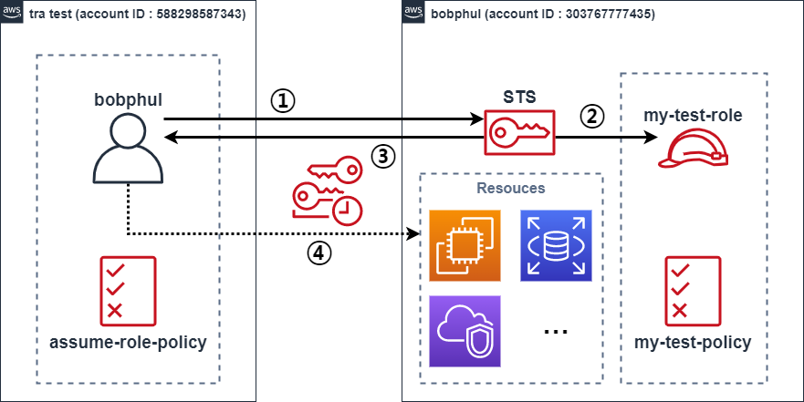
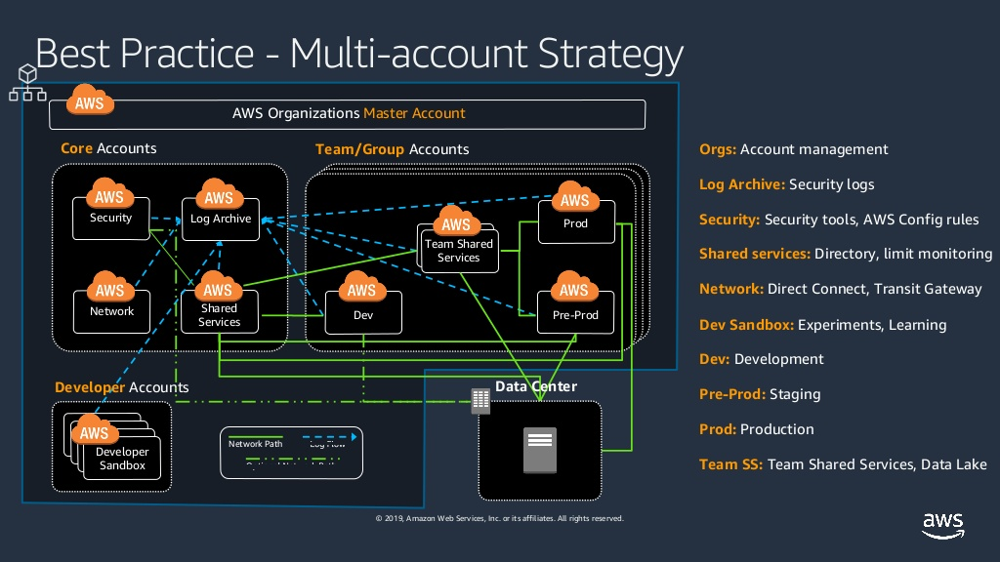
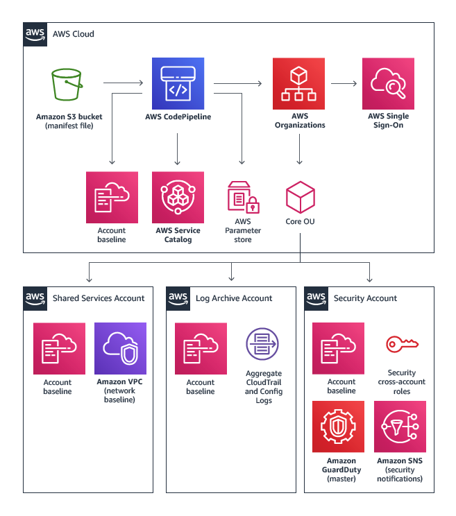

# IAM Cross Account 
IAM Cross Account 테스트 용도로 구성

# AssumeRole
일반적으로 액세스 할 수 없는 AWS 리소스에 액세스하는데 사용할 수 있는 임시 보안 자격 증명을 부여하며, 이러한 임시 자격 증명은 액세스키ID, 비밀 액세스 키 및 보안 토큰으로 구성된다. 
일반적으로 계정 내 또는 계정 간 액세스에 사용하게 된다.

# Environment
- TRA Test 계정(`588298587343`)과 개인 Test 계정(`303767777435`)
- TRA Test 계정 <u>IAM 사용자</u>로 개인 계정 <u>IAM 사용자 없이</u> 콘솔에 로그인하여 사용 할 수 있다.
- **모든 리소스**를 생성하고 삭제까지 가능하도록 **모든 권한**을 부여한다.


### process  
1. 테스트 계정 사용자가 

# 실습 v/AWS Console
## 개인계정 
### Policy

```json
name : my-test-policy

{
    "Version": "2012-10-17",
    "Statement": [
        {
            "Effect": "Allow",
            "Action": "*",
            "Resource": "*"
        }
    ]
}
```

### Role
Trust relationships
```json
name : my-test-role

{
  "Version": "2012-10-17",
  "Statement": [
    {
      "Effect": "Allow",
      "Principal": {
        "AWS": "arn:aws:iam::588298587343:user/bobphul"
      },
      "Action": "sts:AssumeRole",
      "Condition": {}
    }
  ]
}
```
Copy Role ARN & console link  
`arn:aws:iam::303767777435:role/my-test-role`  
https://signin.aws.amazon.com/switchrole?roleName=my-test-role&account=2012504

## ~~TRA계정~~
### ~~Policy~~

```json
name : assume-role-policy

{
    "Version": "2012-10-17",
    "Statement": {
        "Effect": "Allow",
        "Action": "sts:AssumeRole",
        "Resource": "arn:aws:iam::303767777435:role/my-test-role"
    }
}
```

### ~~User~~
~~특정 사용자에 해당 policy 할당~~


# 실습 v/AWS CLI
AWS CLI credential & config 설정 확인
```
C:\Users\<사용자>\.aws\config
C:\Users\<사용자>\.aws\credentials
```
STS(Security Token Service)통한 Assume role 접근
```
aws sts assume-role --role-arn "arn:aws:iam::303767777435:role/my-test-role" --role-session-name "MyTestSession01"
```

AWS CLI 요청자 변경 확인
```
aws sts get-caller-identity

SET AWS_ACCESS_KEY_ID= "blahblahblah"
SET AWS_SECRET_ACCESS_KEY= "blahblahblahblahblahblah"
SET AWS_SESSION_TOKEN= "blahblahblahblah...blahblahblahblah"

aws sts get-caller-identity
```

EC2 생성을 통한 리소스 접근 여부 확인
```
aws ec2 describe-instances

aws ec2 run-instances --image-id resolve:ssm:/aws/service/ami-amazon-linux-latest/amzn2-ami-hvm-x86_64-gp2 --instance-type t2.micro --key-name awstest --security-group-ids sg-0d293927ad12682ba --subnet-id subnet-0634812e8bc77e0a3 --tag-specifications "ResourceType=instance,Tags=[{Key=Name,Value=my-linux-test}]" "ResourceType=volume,Tags=[{Key=Name,Value=my-linux-test}]"

aws ec2 describe-instances
```

AWS STS 연결 정보 제거
```
aws sts get-caller-identity

SET AWS_ACCESS_KEY_ID=
SET AWS_SECRET_ACCESS_KEY=
SET AWS_SESSION_TOKEN=

aws sts get-caller-identity
```

# 실습 v/AWS CLI vol.2
AWS CLI config 파일 추가
```
[profile iamtest]
region = ap-northeast-2
source_profile = tratest
role_arn = arn:aws:iam::303767777435:role/my-test-role
```
추가 설정 profile로 명령어 실행
```
aws ec2 describe-instances --query "Reservations[*].Instances[*].[Tags[?Key=='Name'].Value|[0],InstanceId]" --filters Name=instance-state-name,Values=running --output table --profile iamtest 

------------------------------------------
|            DescribeInstances           |
+----------------+-----------------------+
|  my-linux-test |  i-09c1f708ca67a28b3  |
+----------------+-----------------------+

aws ec2 terminate-instances --instance-ids i-09c1f708ca67a28b3 --profile iamtest

aws ec2 describe-instances --profile iamtest
```
# Best Practice

2019.10.15 Tranformation Day in TAIPEI : AWS Multi-Account Architecture and Best Practices  
https://www.slideshare.net/AmazonWebServices/aws-multiaccount-architecture-and-best-practices

Master Account: **Service control policies**, Consolidated billing, Volume discount, **Minimal resources**, Limited access, **Restrict Orgs role!**  

Core Accounts: Foundational, Once per organization, Have their own development life cycle(Dev/QA/Prod)  
- Security: Security tools and audit, GuardDuty master, Inspector, Firewall Manager, Cross-account read/write, Limited access 
- Log Archive: S3, **CloudTrail Logs**, Security Logs, Alarm on user login, Limited access  
- Shared Services: DNS, LDAP/Active Directory, Deployment tools(Golden AMI, Source Repo/Pipeline), Scanning infrastructure(Inactive instancesm Improper tags), Monitoring, Limited access

Developer Accounts
- Developer Sandbox: Innovation space, Autonomous, Experimentation

Team/Group Accounts: Based on level of needed isolation, Match own development lifecycle
- Dev: Develop and iterate quickly, Collaboration space
- Pre-Prod: Production-like, Staging, Testing, Automated deployment, **Limited access**
- Prod: Production application, Automated deployment, **Limited access**
- Team Shared Service: **Product-specific common services**, Common tooling, Common service, Shared to the team

# Landing Zone - multi account example

https://aws.amazon.com/ko/solutions/implementations/aws-landing-zone/