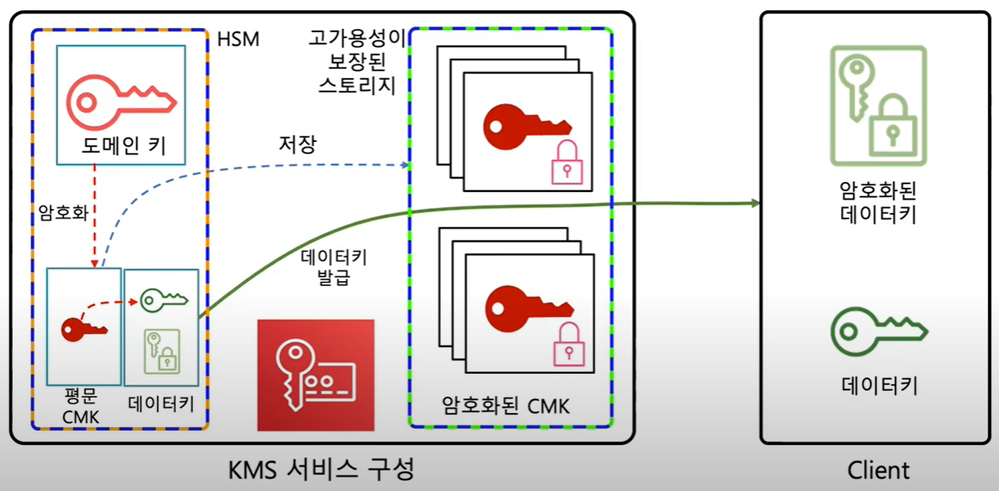
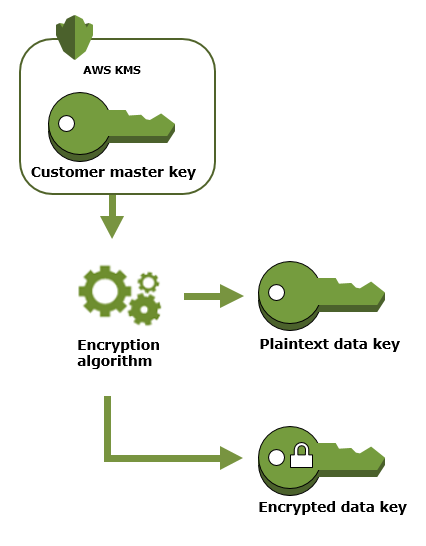
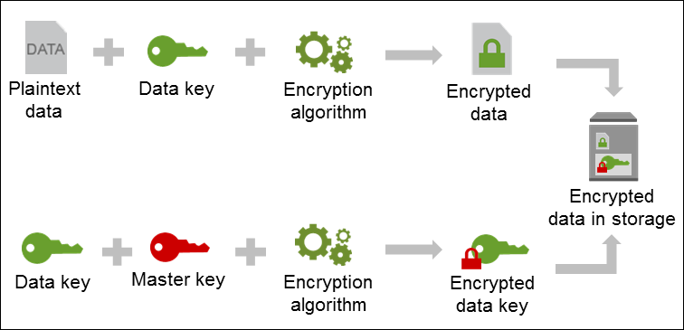
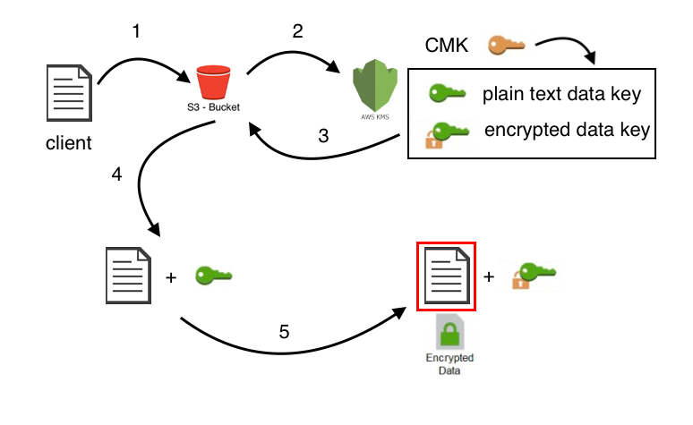
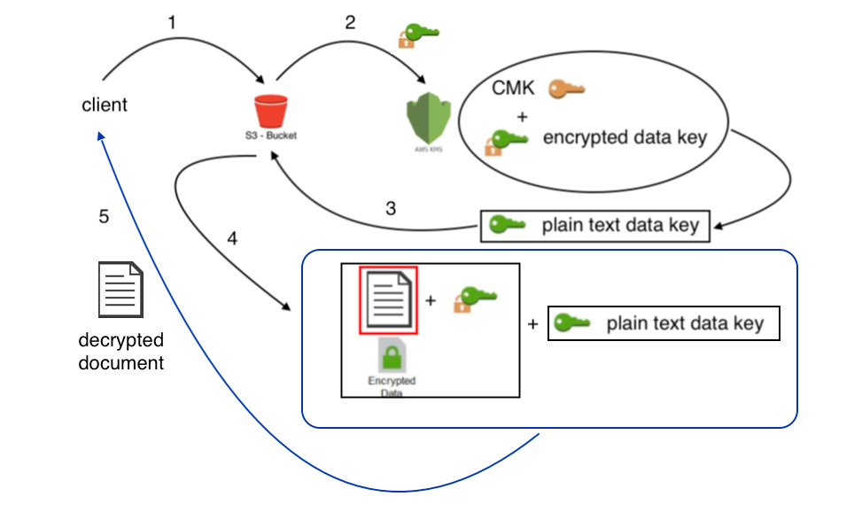

# KMS
AWS Key Management Service(AWS KMS)는 데이터 암호화에 사용하는 암호화 키인 고객 마스터 키(CMK)를 쉽게 생성하고 제어할 수 있게 해주는 관리형 서비스  
주로 S3, EBS, RDS, Redshift, Elastic Transcoder, WorkMail과 통합되어 있고, CloudTrail을 통해서 사용 내역을 로깅할 수 있다.

## 기능
- 대칭 및 비대칭 CMK를 생성 및 확인하고 이러한 CMK의 속성을 편집할 수 있습니다.
- CMK 활성화 및 비활성화
- CMK에 대한 액세스 제어 정책 및 권한 부여 생성 및 보기
- CMK의 암호화 구성 요소 자동 교체 활성화 및 비활성화
- 사용 및 비용을 더욱 쉽게 식별, 범주화 및 추적할 수 있도록 CMK에 태그 지정
- CMK의 친숙한 이름인 별칭 생성, 삭제, 나열 및 업데이트
- CMK를 삭제하여 키 수명 주기 완료

## KMS 키 계층 구조


## 고객 마스터 키(CMK:Customer Master Keys)
AWS KMS의 기본 리소스이며, 키 ID, 생성 날짜, 설명 및 키 상태와 같은 메타데이터가 포함됨.  
일부 AWS 서비스는 AWS 소유 CMK 또는 AWS 관리형 CMK를 사용하여 기본적으로 데이터를 암호화  

유형|메타데이터 보기|관리 가능|계정 종속
:-:|:-:|:-:|:-:
고객 관리형 CMK|예|예|예
AWS 관리형 CMK|예|아니요|예
AWS 소유 CMK|아니요|아니요|아니요

## 사용 사례
### EC2/EBS
- EBS 볼륨 별로 데이터 키를 생성하고, CMK로 암호화한 뒤 볼륨 메타데이터에 저장  
- EC2에 EBS리소스가 붙어 있는 동안, 해당 EBS 볼륨을 암호화하는데 사용되는 평문 데이터 키는 하이퍼바이져의 휘발성 메모리 상에 보관 --> 볼륨, I/O, 스냅샷을 암호화
### S3
- 객체 별로 데이터 키를 생성하고, CMK로 암호화한 뒤, 객체 메타데이터에 저장
- 비정기적인 Get 요청에 대해 S3는 KMS쪽으로 암호화된 데이터 키와 CMK를 지정하여 복호화 요청하고, 복호화된 데이터 키를 받아서 타겟 객체를 복호화 한 뒤, 작업 후 삭제됨.
### CMK 생성 및 관리
- 조직, 데이터 유형, 사용 환경 등에 따라 필요한 키를 적절하게 생성.  
- 멀키 어카운트 환경에서는 암호화 대상이 있는 어카운트에서 키를 생성할 것을 권장
- 자동 키 교체(Retention) 설정 권장
### IAM 관점에서 CMK 정책
- 키 관리자, 삭제, 사용자, 외부 계정을 구분하여 정책을 부여하고 관리
- 리소스 기반 정책
- IAM 정책에서는 꼭 필요한 KMS Action만 지정(⛔kms:*)

### CMK 만들기
    aws kms create-key
### CMK 목록 확인
    aws kms list-keys
### CMK 상세 정보 확인
    aws kms describe-key --key-id xxxxxxxx-xxxx-xxxx-xxxx-xxxxxxxxxxxx

## 키
### 대칭키 vs 비대칭키
- 암호화 및 암호 해독 <span style="color:white">대칭</span>
- 메시지 서명 및 서명 확인 <span style="color:white">비대칭</span>
- 퍼블릭 키 암호화 수행 <span style="color:white">비대칭</span>
- AWS 서비스와 함께 사용 <span style="color:white">대칭</span>

#### 비대칭키 사양
일반적으로 사용 사례 및 규정 요구 사항에 따라 결정이 필요.  
RSA 키 사양 : 암호화 및 암호 해독 또는 서명 및 확인  
타원 곡선 키 : 서명 및 확인

## 데이터 키
많은 양의 데이터 및 기타 데이터 암호화 키를 포함하여 데이터를 암호화하는 데 사용할 수 있는 암호화 키  
AWS KMS를 이용하면 CMK를 만들어서 사용 할 수 있지만, AWS KMS는 데이터 키를 저장,관리 하지는 않는다.  
따라서 데이터키는 AWS KMS 밖에(S3 같은) 저장하고 사용해야 한다

데이터 키는 GenerateDataKey로 만들 수 있다.  
AWS KMS는 지정된 CMK를 이용해서 데이터키를 만든다.  
이때 (암호화되지 않은)일반 텍스트 사본과 CMK로 암호화된 데이터 키의 사본을 반환한다.



데이터 키 생성 예제  
```
    aws kms generate-data-key --key-id arn:aws:kms:ap-northeast-2:3XXXXXXXXXXX:key/xxxxxxxx-xxxx-xxxx-xxxx-xxxxxxxxxxxx --key-spec AES_256

    {
        "Plaintext": "VjqR8leA8vEnkDRNiemYDMDS+aUoUwqaxTZ2JzDICxc=",
        "KeyId": "arn:aws:kms:ap-northeast-2:3XXXXXXXXXXX:key/xxxxxxxx-xxxx-xxxx-xxxx-xxxxxxxxxxxx",
        "CiphertextBlob": "AQIDAHjVppF9a/AvJ4lvj/Hb98qP0MO4PMcKQwF759Ku50AXBwH7TtHXqVbZmYArB2NzREncAAAAfjB8BgkqhkiG9w0BBwagbzBtAgEAMGgGCSqGSIb3DQEHATAeBglghkgBZQMEAS4wEQQMnjrnqQkOhW+8AxbxAgEQgDvqdYurtxALI1/vR32Ae4EN4gHImVLNc87eUhr1SKGMZF9JzRmLxrvU3gIglQdkxApkG3wxu6q+H/BsFA=="
    }  
```

봉투 암호화(Envelop Encryption)


# 실습

환경변수  
```
KEY_ID=xxxxxxxx-xxxx-xxxx-xxxx-xxxxxxxxxxxx     # CMK ID
SECRET_TEXT="cyberlogitec secret text"          # 암/복호화 테스트에 사용할 텍스트
ENCRYPTED_SECRET_AS_BLOB=encrypted_secret_blob  # 암호화파일 이름
DECRYPTED_SECRET_AS_BLOB=decrypted_secret_blob  # 복호화파일 이름

SECRET_BLOB_PATH=fileb://my-secret-blob         # 암/복호화 테스트에 사용할 파일
```

```
aws kms encrypt --key-id %KEY_ID% --plaintext %SECRET_TEXT% --query CiphertextBlob --output text > %ENCRYPTED_SECRET_AS_BLOB%

certutil -decode %ENCRYPTED_SECRET_AS_BLOB% ExampleEncryptedFile

aws kms decrypt --ciphertext-blob fileb://ExampleEncryptedFile --query Plaintext --output text > %DECRYPTED_SECRET_AS_BLOB%

certutil -decode %DECRYPTED_SECRET_AS_BLOB% ExamplePlaintextFile
```

```
aws kms encrypt --key-id %KEY_ID% --plaintext %SECRET_BLOB_PATH% --query CiphertextBlob --output text > %ENCRYPTED_SECRET_AS_BLOB%

certutil -f -decode %ENCRYPTED_SECRET_AS_BLOB% ExampleEncryptedFile

aws kms decrypt --ciphertext-blob fileb://ExampleEncryptedFile --query Plaintext --output text > %DECRYPTED_SECRET_AS_BLOB%

certutil -decode %DECRYPTED_SECRET_AS_BLOB% ExamplePlaintextFile
```

## S3 KMS 동작 예시
암호화


복호화



# 주의 사항
KMS는 관리형 서비스이기에 AWS API로 제어해야하고, API request에 대한 Limitation이 있으므로 Request per seconds값을 확인하면서 사용해야 한다.

# 참고 사항

https://www.youtube.com/watch?v=B7JTWT3vfis