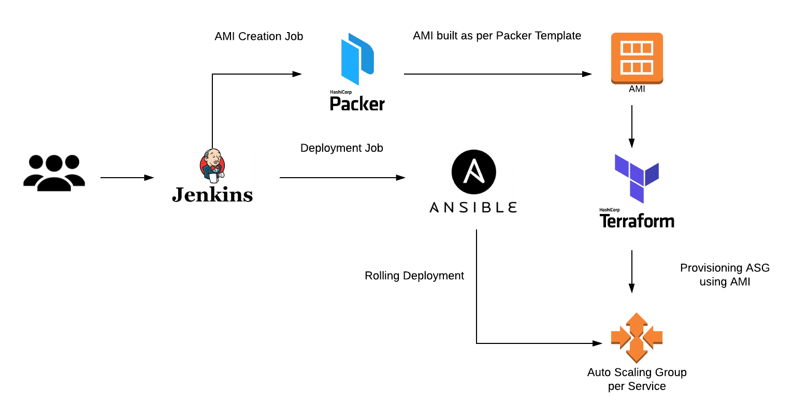

# 1. 목표
> **Autoscale** 가능한 아키텍쳐

# 2. 환경
기본 환경은 AWS를 이용하고, 다른 클라우드(Azure, Oracle..)에서도 적용 가능한지 고려

| Item | Description |
| ------ | ------ |
| VPC | virtual network environment |
| EC2 | Compute instance |
| AMI | Machine Image |
| Security Group | Network In/Outbound rule |
| ELB | Load Balancer (aka. L4) |

# 3. 설명

## 3.1 AutoScale

AutoScale의 경우 Scale Out을 통한 서버 대수를 늘려 처리 능력을 향상
AWS : EC2 Auto Scaling
Azure : Virtual Machine Scale Sets

### 3.1.1 구성요소

1. Groups : 인스턴스 수 지정
2. Configuration templates : AMI, 인스턴스 타입, 키페어, 보안그룹 등
3. Scaling options : 동작 조건 설정

## 3.2 AMI

AMI 종류
1. AWS 기본 이미지
2. AWS Marketplace 이미지
3. **Custom 이미지**

AMI(Amazon Machine Image)는 EC2를 처음 구성할때 지정하는 소프트웨어가 구성된 일종의 템플릿

## 3.3 프로비저닝(Provisioning)

사용자의 요구에 맞게 서버를 설정해 두었다가 필요 시 서버를 즉시 사용할 수 있는 상태로 미리 준비해 두는 것 (feat. wikipedia)
ex) JDK나 MySQL을 미리 설치하거나 설정

### 3.3.1 도구
#### 3.3.1.1 [Packer](https://packer.io/)
Build Automated Machine Images
1. Builder : 이미지 생성할 플랫폼 지정 (AWS, Azure, Google, docker, vmware, Hyper-V, Naver...)   
2. Provisioner : 이미지 생성할 때 사용할 빌드 도구 (Shell, Ansible, Chef, Salt, Puppet..)
3. Template : Builder + Provisioner 설정 파일 (output:json)

#### 3.3.1.2 [Ansible](https://www.ansible.com/)
Title Bar : Ansible is Simple IT Automation
Automation for everyone

#### 3.3.1.3 [terraform](https://www.terraform.io/)
Use Infrastructure as Code to provision and manage any cloud, infrastructure, or service

### 3.3.2 Pipeline

